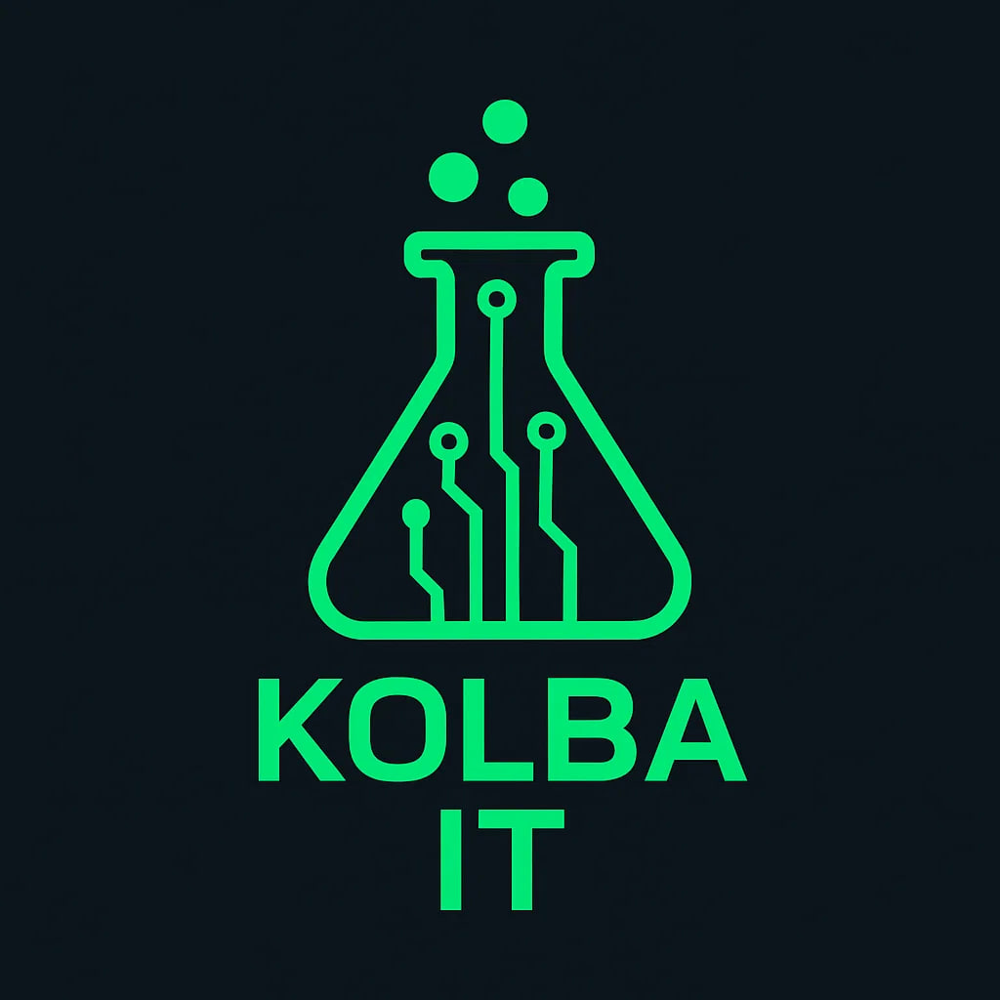

  

# KOLBA IT

Мы — технологическая студия разработки.  
Создаём современные **веб-приложения, чат-ботов и парсеры**, а также усиливаем решения с помощью **AI-модулей**.

---

## 🔹 Направления

### 🌐 Веб-разработка

Сайты (лендинги, визитки, портфолио), веб-сервисы и внутренние панели, корпоративные приложения.

-   AI-усиление: аналитика и визуализация данных (обработка таблиц, построение графиков и отчётов).

---

### 🤖 Чат-боты

Telegram-боты для консультаций, сервисных задач и автоматизации.

-   AI-усиление: интеграция LLM (GigaChat, OpenAI) для умных ответов и поиска по базе знаний.

---

### 📊 Парсеры и интеграции

Сбор данных с сайтов, API и корпоративных систем, экспорт в Excel/CSV/БД.

-   AI-усиление: очистка, анализ и прогнозирование по собранным данным.

---

### 🔬 AI-модули

Отдельные интеллектуальные решения или дополнения к проектам:

-   интеграция LLM в сервисы и ботов;
-   обработка и визуализация данных;
-   прогнозирование по временным рядам и ML-моделям (CatBoost, scikit-learn);
-   компьютерное зрение (YOLO, распознавание объектов).

---

## ⚙️ Технологии

-   **Frontend / Desktop**: React, TypeScript/JavaScript, Tauri
-   **Backend / DB**: Python (FastAPI, SQLModel), PostgreSQL
-   **AI / ML**: GigaChat API, FAISS, CatBoost, pandas, scikit-learn
-   **DevOps**: Docker, GitHub Actions

---

## 📊 Проекты и опыт

### 📌 Telegram-бот «Консультант по СМК»

Интеллектуальный бот для консультаций по вопросам менеджмента качества.  
Использует **RAG-подход**: ответы формируются с помощью LLM (GigaChat), дополненные данными из локальной базы знаний.  
**Стек:** Python, python-telegram-bot, GigaChat API, FAISS.

---

### 📌 Калькулятор индекса качества

Кроссплатформенное приложение для расчёта индекса качества и визуализации результатов.  
Реализован ввод экспертных оценок, автоматический расчёт по формуле и построение радарных диаграмм.  
**Стек:** React, TypeScript, Tauri.

---

### 📌 Веб-платформа для планирования и проведения аудита (в разработке)

Сервис для организации аудитов и анализа их результатов.  
Поддерживает планирование аудита, назначение экспертов, сбор оценок и построение аналитических отчётов.  
**Стек:** React, FastAPI, SQLModel, PostgreSQL.

<!-- *(часть проектов приватные, доступно описание кейсов)*   -->

<!-- ## 🤝 Партнёры
- [Самарский университет](https://ssau.ru/)   -->

---

## 📩 Контакты

-   Email: **kolba-it@yandex.ru**

---

✨ Мы открыты для сотрудничества: пишите, обсудим ваш проект!
